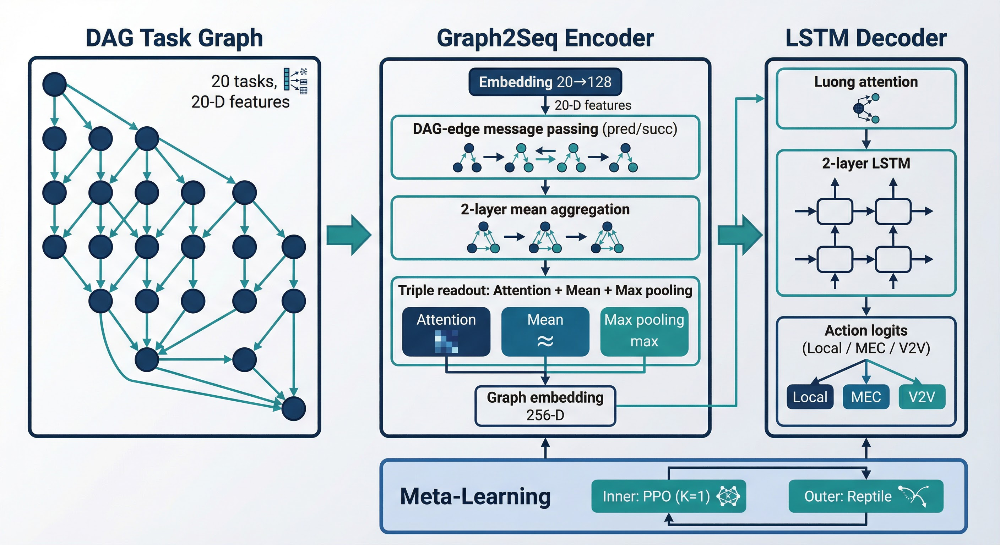
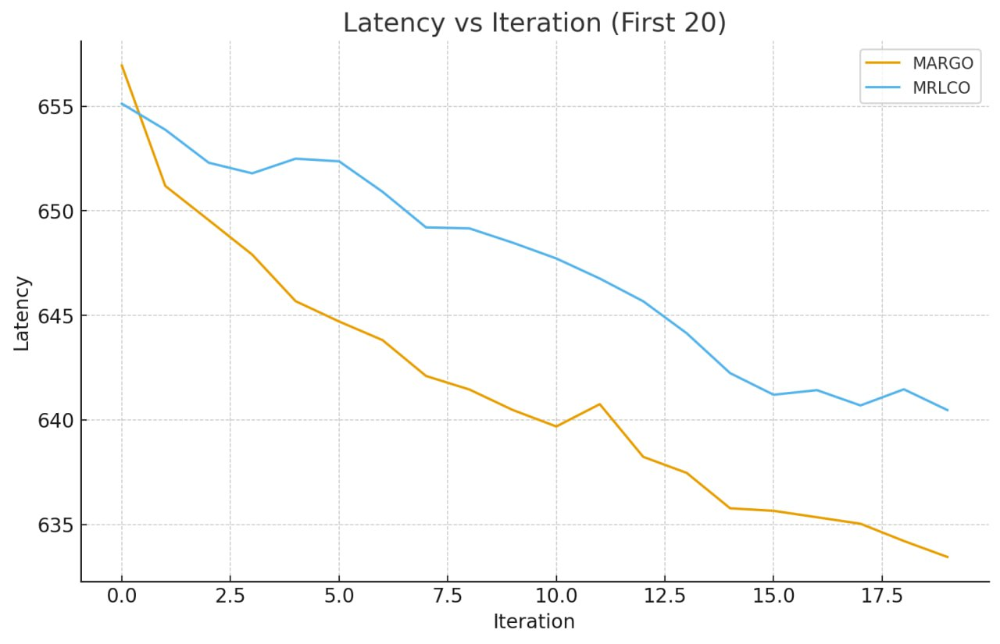
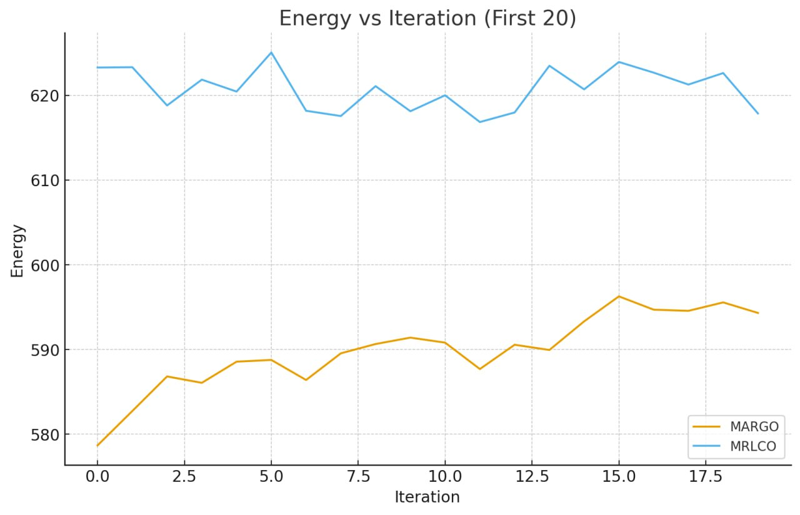
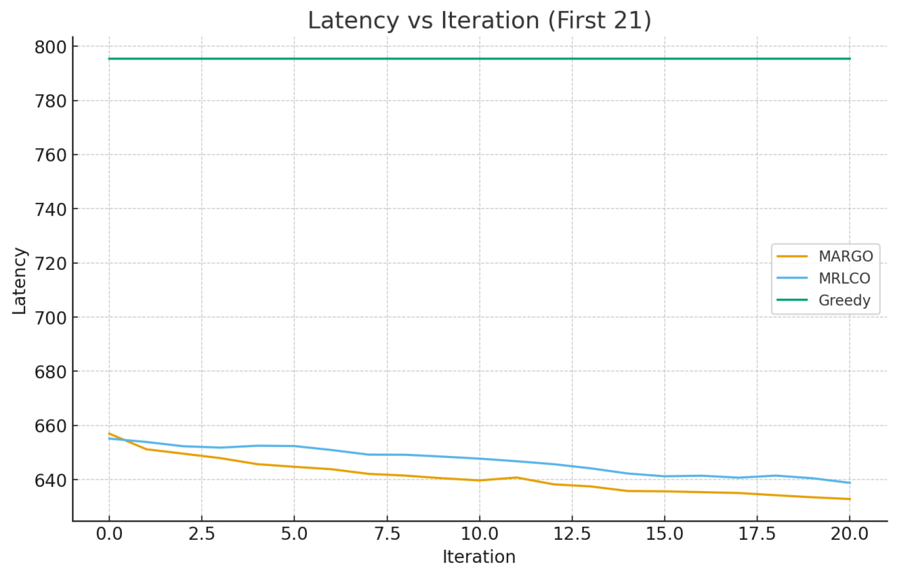
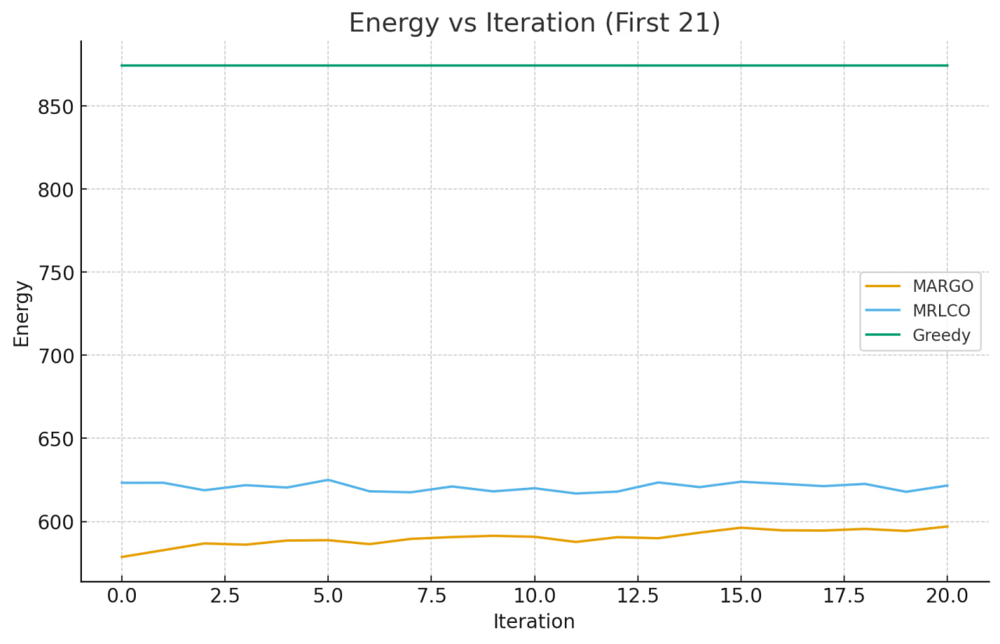

# MARGO

**Meta-learning with Attention-augmented gRaph-to-sequence for energy-aware task Offloading**

---

> **📄 Under publication.** This repository accompanies the paper *MARGO: Meta-learning with Attention-augmented Graph-to-Sequence Encoder for Joint Latency–Energy Optimization in V2V-assisted Mobile Edge Computing*. The work is currently under review.

---

## What is MARGO?

**MARGO** is a meta-reinforcement learning framework for deciding where to run each task in an app that’s modeled as a DAG. Think of a host vehicle (e.g. in V2X or autonomous driving) that can run tasks locally, send them to a roadside MEC server, or offload to a nearby V2V helper. MARGO learns one meta-policy that adapts quickly when conditions change (different task graphs, channel quality, or load) using only a few gradient steps. It picks local, MEC, or V2V per task and optimizes both latency and energy. Under the hood it uses a graph neural encoder (with multi-layer attention and a triple readout) plus an LSTM decoder, so task dependencies are respected and the agent gets strong gains in latency and energy (e.g. around 18–20% lower latency and 29–32% lower energy than greedy in the paper).

---

## Architecture

MARGO has four main building blocks: **(1)** a **Graph2Seq encoder** that turns the DAG and 20-D task features into node embeddings, **(2)** a **triple readout** (attention + mean + max pooling) for a graph-level representation, **(3)** an **LSTM decoder** with Luong attention that outputs one action per task, and **(4)** **Reptile-style meta-learning** with PPO as the inner optimizer.



| Component | Description |
|-----------|-------------|
| **Input** | DAG with 20 tasks; each task has a 20-D feature vector (index, local/MEC/V2V times, predecessor/successor indices, etc.). |
| **Graph2Seq encoder** | Embedding (20→128), **DAG-edge-based** message passing (predecessor/successor neighborhoods only), **2-layer mean aggregation**. Output: node embeddings (256-D per node). |
| **Triple readout** | **Attention** (learned task importance), **mean** (average behavior), **max** (bottlenecks). Fused and projected to a 256-D graph embedding. |
| **LSTM decoder** | 2-layer LSTM (hidden 128), **Luong attention** over encoder outputs. Produces **action logits for 3 actions**: Local (0), MEC (1), V2V (2). |
| **Meta-learning** | **Inner loop:** PPO (e.g. K=1 step) on each task in the meta-batch. **Outer loop:** Reptile meta-update. **Meta-batch:** e.g. 10 task distributions per iteration. |

The encoder is the main structural novelty: it respects the DAG (pred/succ) instead of treating tasks as a flat sequence, and the triple readout gives the decoder a compact, dependency-aware summary of the whole graph.

---

## Problem and System Model

### Setting

- **User Equipment (UE):** A vehicle running the application; limited CPU, can run tasks locally (no transmission).
- **MEC server:** Edge server at RSU/BS; high CPU; uplink/downlink to UE (full-duplex).
- **V2V helper:** Nearby vehicle; CPU similar to UE; **half-duplex** V2V channel (no simultaneous uplink and downlink).

Each **task** has: workload and output data sizes, predecessors and successors (DAG), and derived times (local, MEC uplink/downlink, MEC compute, V2V uplink/downlink, V2V compute). The **action** for each task is: **0** = Local, **1** = MEC, **2** = V2V. The **objective** is:

$$\min_\pi \; \mathbb{E}\left[ \alpha \cdot C_{latency} + (1-\alpha) \cdot C_{energy} \right]$$

with **makespan** \(C_{latency}\) and **total energy** \(C_{energy}\); default \(\alpha = 0.5\). Energy models: DVFS-style for local compute; transmission/reception power for MEC and V2V; optional V2V computation cost (e.g. \(\rho_{v2v} = 0.7\)).

---

## Dataset and Task Distributions

- **Total:** 1,900 DAGs = **19 task distributions** × **100 graphs** per distribution; **20 tasks per graph**.
- **Meta-train:** 15 distributions (1,500 graphs).
- **Meta-test:** 4 held-out distributions (400 graphs) for adaptation evaluation.

Graphs are stored as **Graphviz (`.gv`)** files. Each distribution lives under a path like:

`env/mec_offloaing_envs/data/meta_offloading_20/offload_random20_<id>/random.20.<i>.gv`  
for `i = 0..99`. The environment loads batches of graphs from these paths; the trainer uses 19 such distribution paths (see `meta_trainer.py`), and the evaluator uses a single path (e.g. `offload_random20_12`) for fine-tuning and evaluation.

Task features are **20-D** per task (see paper): task index, local/MEC/V2V timing terms, and up to 6 predecessor and 6 successor indices (padding with -1). The simulator orders tasks by a rank-based prioritization (critical-path style) for scheduling.

---

## Results

MARGO is evaluated with explicit meta-train/meta-test splits. After meta-training (e.g. 3,500 iterations, meta-batch 10, inner steps K=1) and fine-tuning on held-out distributions:

- **Latency:** ~17.8–20.3% reduction vs greedy.
- **Energy:** ~28.9–32.0% reduction vs greedy.

Ablations in the paper show: the GNN encoder improves over sequential encoding (latency and energy); V2V adds a significant energy gain; and \(\alpha=0.5\) gives a good latency–energy trade-off.

**Task 1 results (distribution 1).** Below, comparison with MRLCO (latency and energy), then comparison with the greedy baseline (latency and energy).

*Comparison with MRLCO (latency and energy):*





*Comparison with greedy baseline (latency and energy):*





---

## Repository Layout

| Path | Role |
|------|------|
| `meta_trainer.py` | Main entry: build env, policy, meta-algorithm, sampler; run meta-training. |
| `meta_evaluator.py` | Load meta-model; fine-tune and evaluate on a chosen task distribution. |
| `assets/` | README figures (e.g. architecture). Add images here to display on Git. |
| `results/` | Experiment figures: `mrlco-compare/1/` and `2/` (Task 1 & 2 vs MRLCO and vs greedy). Used in README Results section. |
| `policies/` | `meta_seq2seq_policy.py`, `graph2seq_encoder.py`, `graph2seq_modules/` (encoder + decoder). |
| `meta_algos/` | Reptile + PPO meta-RL algorithm. |
| `env/mec_offloaing_envs/` | MEC/V2V environment, DAG parsing (`.gv`), resources, energy config. |
| `samplers/` | Seq2Seq meta-sampler and sample processor (rollouts, GAE, etc.). |
| `baselines/` | Value function baseline for advantage estimation. |
| `utils/` | Logging and session helpers. |
| `paper/` | LaTeX paper and figure notes. |

---

## Getting Started

### Environment

- **OS:** Ubuntu 16.04 or compatible.
- **Python:** 3.6 (e.g. via Anaconda).
- **TensorFlow:** 1.15 (GPU or CPU).

```bash
# System
sudo apt-get update && sudo apt-get install cmake libopenmpi-dev python3-dev zlib1g-dev

# Conda
conda create --name tf-1.15 anaconda python=3.6
conda activate tf-1.15

# TensorFlow
pip install tensorflow-gpu==1.15   # or tensorflow==1.15

# Other
pip install gym graphviz pydotplus pyprind mpi4py
```

### Training

Hyperparameters, log path, and data paths are set in `meta_trainer.py` (e.g. meta-batch size, energy config, list of `graph_file_paths`).

```bash
python meta_trainer.py
```

Logs (and optional reports) are written to the directory configured in the script (e.g. `./meta_offloading20_log-inner_step1/`).

### Evaluation

After training, run the evaluator to fine-tune and evaluate on a specific task distribution (e.g. `offload_random20_12`):

```bash
python meta_evaluator.py
```

Evaluation logs and metrics are produced as configured in `meta_evaluator.py`.

---

## Citation

If you use this code or the MARGO method, please cite the paper (once published):

```bibtex
@article{margo2025,
  title   = {MARGO: Meta-learning with Attention-augmented Graph-to-Sequence Encoder for Joint Latency-Energy Optimization in V2V-assisted Mobile Edge Computing},
  author  = {[Authors]},
  journal = {[Journal]},
  year    = {[Year]}
}
```

---

*MARGO — Meta-learning with Attention-augmented gRaph-to-sequence for energy-aware task Offloading.*
