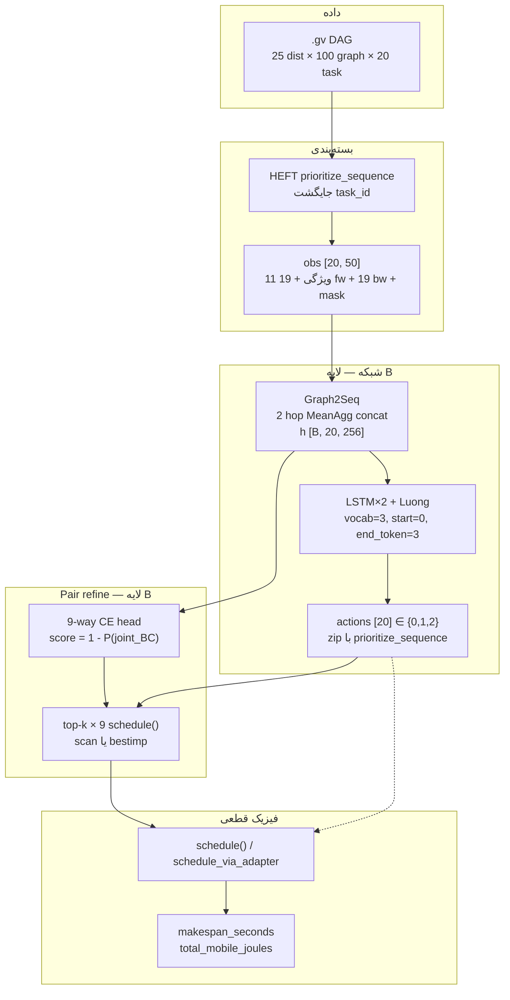
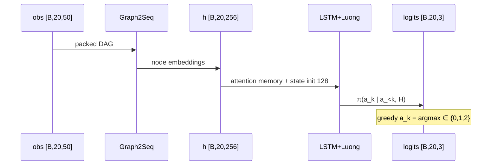
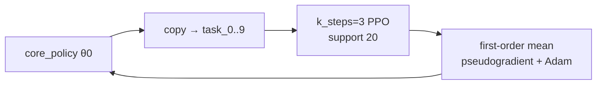
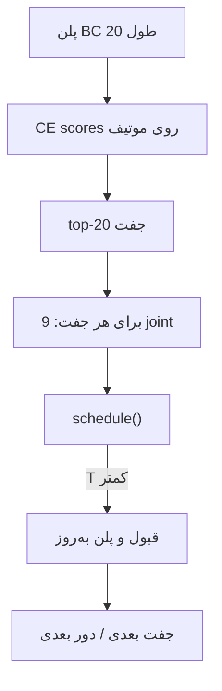

# معماری فعلی MARGO (`mrlco-new`)

منبع حقیقت: کد + `spec/frozen_experiment.yaml` + `spec/SYSTEM_SPEC.md`.  
نسخه مشخصات: `MARGO-SPEC-v0.1`.  
این فایل توصیف **سیستم پیاده‌شده** است، نه ادعای مقاله. `paper_result=false` تا eval پنج‌بذر قفل‌شده وجود داشته باشد.

روش مقالهٔ هدف (`MARGO-METHOD-v0.2-cavia`) در این فایل نیست. برو به [FINAL_README.md](FINAL_README.md). آنجا: پلن از `π(a|h,z)`، few-shot = CAVIA روی `z`، `schedule()` فقط فیزیک. جستجوی جفت و inner PPO روی θ روش نیستند.

دو لایهٔ **کد فعلی** را قاطی نکن:

| لایه | چیست | وضعیت |
|---|---|---|
| **A. Primary فریز** | Meta-RL / PPO داخلی `k_steps=3`، outer 3500، هدف `0.5/0.5` | در کد هست. **اجرا نشده.** موتور روش v0.2 نیست. |
| **B. مسیر علمی diagnostic** | BC روی Graph2Seq+LSTM، سپس pair refine با `schedule()` واقعی | اندازه گرفته شد. سقف heuristic است نه روش مقاله. |

Planner type: **macro-action autoregressive**. سیاست یک پلن کامل طول `N=20` می‌سازد. محیط **یک‌بار** کل پلن را زمان‌بندی می‌کند؛ مشاهدهٔ میانی منبع بعد از هر توکن وجود ندارد.

---

## 1. تصویر کلان



PPO/meta (لایه A) در بخش ۷ است. روی مسیر B سوار نیست.

---

## 2. مسئله و قرارداد واحدها

مسئله: offloading یک DAG بیست‌تسکی روی سه مکان اجرا.

| شناسه | نام | `Location` | معنی |
|---:|---|---|---|
| **0** | UE / Local | `Location.UE` | اجرا روی موبایل |
| **1** | MEC | `Location.MEC` | اجرا روی لبه |
| **2** | HELPER / V2V | `Location.HELPER` | اجرا روی همسایه |

نگاشت: `Location.from_action` در `env/mec_offloaing_envs/scheduler/model.py`.  
فضای خام: `3^20`. روش فعلی این فضا را جستجو نمی‌کند.

واحدها (`frozen_experiment.yaml`):

- زمان: ثانیه (`makespan_seconds`)
- انرژی: ژول (`total_mobile_joules` = UE + HELPER؛ compute MEC در v0.1 صفر است)
- داده: بایت
- نرخ لینک: `bytes_per_second` از Mbps میبی‌بیتی: `mbps * 1024^2 / 8`

منابع فریز:

| منبع | نرخ |
|---|---|
| UE CPU / HELPER CPU | `1 * 1024^2` B/s |
| MEC CPU | `10 * 1024^2` B/s |
| MEC UL / DL | 7 Mbps → `917504` B/s |
| V2V | 5 Mbps → `655360` B/s |

ظرفیت هر تقویم منبع = 1 (غیرپیش‌دستانه). V2V نیمه‌دوطرفه.

Makespan وقتی تمام می‌شود که خروجی **همه sinkها به UE برگشته باشد** (`task_output_bytes`، hop برگشت طبق جدول مسیر).

هدف primary فریز: `0.5 * latency_norm + 0.5 * energy_norm`.  
مسیر diagnostic BC/pair غالباً latency خالص روی `schedule().makespan_seconds` است.

---

## 3. گراف ورودی

فایل: `env/mec_offloaing_envs/data/meta_offloading_20/offload_random20_{id}/random.20.{i}.gv`

پارس: `OffloadingDotParser` / `OffloadingTaskGraph` در `env/mec_offloaing_envs/offloading_task_graph.py`.

- شناسه نود در فایل 1-based؛ در حافظه `task_id = job_id - 1` ∈ `{0..19}`.
- صفت نود `size` → `processing_data_size` = حجم محاسبه (بایت).
- صفت نود `expect_size` → `transmission_data_size` = خروجی تسک (بایت).
- صفت یال `size` → بایت وابستگی.

`to_canonical_dag` (`scheduler/adapter.py`) می‌سازد:

- `CanonicalTask(task_id, compute_workload_bytes, task_output_bytes, external_input_bytes)`
  - root: `external_input_bytes = processing_data_size`
  - غیر-root: `external_input_bytes = 0`
- `CanonicalEdge(src_task_id, dst_task_id, edge_output_bytes)` از `edge_set` نه از ماتریس (ماتریس duplicate را overwrite می‌کند).

ترتیب decoder = HEFT `prioritize_tasks(resource_cluster)` → `prioritize_sequence`: جایگشت `task_id`.  
توکن `k` شبکه = تسک `prioritize_sequence[k]`. این دو شاخص را قاطی نکن.

```text
task_id tid     = گره فیزیکی DAG
decoder index k = موقعیت در دنباله HEFT = سطر obs و اندیس action
```

---

## 4. Observation — ورودی انکودر

فایل: `env/mec_offloaing_envs/scheduler/encoder_obs.py`

```text
MAX_TASKS  = 20
MAX_NEIGH  = 19
PAD_INDEX  = -1
FEATURE_DIM = 11
PACKED_DIM  = 11 + 2*19 + 1 = 50
```

هر گراف: `obs ∈ R^{20 × 50}`. بچ: `[B, 20, 50]`، `time_major=False`.  
`OffloadingEnvironment.input_dim = 50`.

چینش هر سطر decoder-index `k`:

```text
[ 11 ویژگی نود | 19 successor decoder-idx | 19 predecessor decoder-idx | mask ]
```

جدول همسایه **اندیس decoder** دارد نه `task_id`. بدون self-loop. درجه > 19 خطا است.

یازده ویژگی (`FEATURE_NAMES`):

1. `compute_workload_bytes`
2. `task_output_bytes`
3. `external_input_bytes`
4. `incoming_edge_bytes`
5. `outgoing_edge_bytes`
6. `indegree`
7. `outdegree`
8. `decoder_index`
9. `depth`
10. `is_root`
11. `is_sink`

Z-score همه جز `is_root` / `is_sink` با `spec/encoder_feature_stats.json` (فقط meta_train).  
`GNN_LAYERS=2`, `AGGREGATOR=masked_mean`, `NEIGHBORHOOD=predecessor_and_successor`, `DIRECTION_COMBINE=sum`, `ENCODER_DROPOUT=0.0`, `SELF_NEIGHBOR_CONCAT=True`.

بارگذاری env (`OffloadingEnvironment.__init__`):

1. برای هر dist prefix، 100 گراف `.gv`.
2. HEFT → `prioritize_sequence`.
3. `encode_task_graph` → packed obs.
4. `batch_size=100` → `encoder_batchs`, `task_graphs_batchs`, `decoder_full_lengths` (=20).

---

## 5. Graph2Seq encoder

فایل‌ها:

- `policies/graph2seq_encoder.py` — `Graph2SeqEncoderAdapter`, `create_graph2seq_encoder`
- `policies/graph2seq_modules/aggregators.py` — `MeanAggregator` (استفاده می‌شود)
- `policies/graph2seq_modules/neigh_samplers.py` — `UniformNeighborSampler`
- سیم‌کشی: `policies/meta_seq2seq_policy.py` → `Seq2SeqNetwork`

`encoder_units = hidden_dim = 128`. خروجی نود **256** است، نه 128.

### جریان تنسور

```text
obs [B, 20, 50]
  unpack → features [B,20,11], fw/bw [B,20,19], mask [B,20]
  Dense → embed [B,20,128]
  + ردیف dummy صفر برای PAD

هر جهت (fw = successor، bw = predecessor)، 2 لایه MeanAggregator:
  لایه 0: input 128, concat(self, neigh) → 256
  لایه 1: input 256, concat → 256
  reshape [B, 20, 256]

encoder_outputs h = ReLU(fw_hidden + bw_hidden)
                 ∈ R^{B × 20 × 256}

readout برای init LSTM (نه برای pair):
  mean ∥ max ∥ attn  روی نودها → Dense(256) → Dense(128)
  LSTMStateTuple(c=h=proj) × num_layers=2
```

Attention decoder روی `encoder_outputs` است (`[B,20,256]`).  
Pair head هم همان `encoder_outputs` را می‌گیرد.

ثابت مهم: اسناد قدیمی گاهی `obs_dim=20` نوشته‌اند. **کد `50` است.**

---

## 6. LSTM decoder + Luong

فایل: `policies/meta_seq2seq_policy.py` — `Seq2SeqNetwork.create_decoder`, `Seq2SeqPolicy`

| مورد | مقدار |
|---|---|
| سلول | LSTM، `num_layers=2` |
| `decoder_units` | 128 |
| Attention | `LuongAttention(128, encoder_outputs)` + `AttentionWrapper(..., attention_layer_size=128)` |
| خروجی | Dense → `vocab_size = n_features = 3` |
| `start_token` | **0** |
| `end_token` | **3** — بیرون `{0,1,2}` |
| embedding توکن | `[3, 128]` — فقط actions 0/1/2 |

`end_token` نباید 2 باشد. 2 = V2V. `GreedyEmbeddingHelper` با `end_token=2` decode را قطع می‌کرد و طول پیش‌بینی با 20 نمی‌خواند. پد: `align_greedy_pred` با `GREEDY_PAD_ACTION=1` (MEC).

سه helper:

| حالت | Helper | رفتار |
|---|---|---|
| `train` | `TrainingHelper` | teacher forcing روی `decoder_inputs` |
| `sample` | sample Categorical | طول ثابت 20؛ EOS استفاده نمی‌شود |
| `greedy` | `GreedyEmbeddingHelper` | argmax؛ ممکن است روی `end_token=3` بایستد |

ورودی train:

```text
decoder_inputs  = [start_token=0] + actions[:, :-1]
decoder_targets = actions            # طول 20، مقدار ∈ {0,1,2}
decoder_full_length = 20
```

خروجی greedy eval: `greedy_decoder_prediction` → `[B, T≤20]` → pad به 20 → zip با `prioritize_sequence` → `schedule()`.

Q-head و `vf = Σ π·q` برای PPO لایه A وجود دارد. مسیر B از آن‌ها برای تصمیم نهایی استفاده نمی‌کند.



---

## 7. فیزیک `schedule()`

فایل‌ها: `scheduler/engine.py` (`schedule`)، `scheduler/adapter.py` (`schedule_via_adapter`)، `scheduler/routes.py`.

ورودی:

```text
plan: list[(task_id, action)]   action ∈ {0,1,2}
decoder_order = prioritize_sequence
CanonicalDAG + ResourceConfig
```

خروجی `ScheduleResult`:

- `makespan_seconds`
- `energy.total_mobile_joules`
- رکورد تسک/انتقال (شروع، پایان، مکان، hop)

الگوریتم: ترتیب توپولوژیک پایدار با `decoder_rank` به‌عنوان tie-break. برای هر تسک:

1. داده ورودی از والدین (یا external root از UE) با جدول مسیر به مکان اجرا برسد.
2. CPU مکان اجرا در تقویم منبع رزرو شود.
3. residency خروجی = مکان اجرا.
4. sinkها در پایان به UE برگردند.

جدول مسیر 3×3:

| از \ به | UE | MEC | HELPER |
|---|---|---|---|
| UE | ∅ | MEC_UL | V2V |
| MEC | MEC_DL | ∅ | MEC_DL + V2V |
| HELPER | V2V | V2V + MEC_UL | ∅ |

همین `schedule()` هم در BC eval و هم در هر trial جفت صدا می‌شود. شبکه زمان را پیش‌بینی نمی‌کند؛ فیزیک قطعی است.

`OffloadingEnvironment.step(action)` (لایه A): پلن کامل را می‌گیرد، `telescoping_token_rewards` می‌سازد:

```text
P_t = پیشوند actionهای تصمیم‌گرفته + پسوند all_UE (fill=0)
r_t = -(0.5 ΔL/L_scale + 0.5 ΔE/E_scale)
sum_t r_t ≡ امتیاز کل پلن نسبت به مرجع
done = True بعد از یک پلن
```

مسیر pair refine مستقیماً `makespan_seconds` را کمینه می‌کند، نه `r_t`.

---

## 8. لایه A — Meta / PPO (کد هست، موتور کاغذ نیست)

ورود: `meta_trainer.build_frozen_primary_stack`.

```text
n_itr / outer_iterations = 3500
parallel = False
latency_weight = energy_weight = 0.5
META_BATCH_SIZE = 10
K_STEPS = num_inner_grad_steps = 3
PPO_BATCH_SIZE = support = 20
inner_lr = outer_lr = 5e-4
clip = 0.2
entropy_coefficient = 0.0
encoder_units = decoder_units = 128
max_path_length = 20000
validation_interval = 50
```

اشیاء سیاست:

| شیء | نقش |
|---|---|
| `core_policy` | θ₀ بیرونی؛ checkpoint |
| `meta_policies[0..9]` | کپی inner برای هر اسلات متا-بچ |
| `validation_policy` + `HeldOutQueryEvaluator` | val؛ گزارش k∈{0,3} |

Outer: `MRLCO.UpdateMetaPolicy` → `mean_pseudogradient`:

```text
g = mean_i (θ₀ - θ_i) / (α * k_steps)
```

سپس یک Adam روی core، بعد کپی به task policies.

Inner: برای هر تسک متا، 3 گام Adam PPO روی 20 مسیر support.

Diagnostics نشان داد unconstrained PPO بعد از BC حوضچه expert را خراب می‌کند. **روش زنده B این حلقه را صدا نمی‌زند.** Split متا (خانواده گراف) برای ارزیابی OOD هنوز همان است.



---

## 9. لایه B — BC (مسیر واقعی یادگیری)

فایل‌ها: `spec/bc_greedy_mec.py`، `scheduler/greedy.py`، `spec/twopt_expert.py`، درایور `spec/phase4_train_driver.py`.

### معلم‌ها

| نام | تابع | شروع | قانون |
|---|---|---|---|
| greedy-from-MEC | `greedy_from_mec_plan(..., max_passes=2)` | همه 1 (MEC) | flip توکن فقط اگر makespan **سخت** کم شود |
| 2-opt | `iterate_2opt` از greedy-from-MEC | جستجوی جفت | سقف CPU / لیبل BC فعلی |
| publication greedy | `greedy_plan` | خالی + all_UE fill | **معلم BC نیست** |

کش:

```text
runs/phase4/expert_{greedy_mec|2opt_mec}_{train,validation,metatest}.npz
obs [N,20,50], acts [N,20] ∈ {0,1,2}, t_expert, t_mec, dist_id
N_train=1500, N_val=N_test=500
```

آموزش: Adam `5e-4` روی CE معلم‌force (`neglogp` teacher). بچ 32. ckpt: `bc_core.ckpt`.  
Eval: greedy decode + `schedule_via_adapter`.

نتیجه قفل‌شده (diagnostic، نه مقاله): train 2-opt را کلون می‌کند (token ~0.965). Holdout کلون نمی‌شود (val T **581.8** vs 2-opt **423.6**).

---

## 10. لایه B — Pair interaction

فایل‌ها: `spec/pair_head.py`، `spec/pair_seq.py`.  
Encoder فریز از `bc_2opt`. LSTM عوض نمی‌شود.

### واحد جفت

جفت روی **اندیس decoder** از موتیف DAG:

- **direct**: یال parent–child
- **sibling**: فرزندان یک پدر (fork)
- **join**: پدران یک فرزند

الماس می‌تواند چند پرچم همزمان داشته باشد. میانگین ~60 جفت / گراف 20 نودی (نه C(20,2)=190).

### ویژگی جفت

```text
h_i, h_j ∈ R^{256},  z = mean_k h[k]
feat = [h_i | h_j | h_i⊙h_j | h_i−h_j | z | direct, sibling, join, (j−i)/20]
     ∈ R^{1284}
```

### 9 حالت

`joint_id(a_i, a_j) = a_i * 3 + a_j` ∈ `{0..8}`.  
Softmax CE روی لیبل 2-opt. رتبهٔ جستجو:

```text
score(i,j) = 1 - P_head(joint = (plan_BC[i], plan_BC[j]))
```

یعنی «کجا شبکه نسبت به پلن BC مطمئن نیست»، نه پیش‌بینی ΔT.

### جستجو

هر جفت انتخاب‌شده: 9 پلن آزمایشی، هر کدام یک `schedule()`. قبول اگر T کم شود.

| الگوریتم | رفتار | بودجه نوعی / گراف |
|---|---|---|
| `refine_topk` scan | یک گذر روی top-k، هر بهبود در مسیر قبول | k=20 → 180 |
| `refine_multipass` | تکرار scan تا 4 دور | ≤720 |
| `refine_bestimp` | هر دور فقط بهترین حرکت بین top-k؛ تا 8 دور | ~4×180 |
| `oracle_motif_search` | هر دور بهترین جفت **همه** موتیف‌ها | ~2732 |

k پیش‌فرض مقالهٔ عملی: **20**. k∈{10,20,50} ablation.

شواهد قفل sequential (`pair_seq`، جستجو نه روش):

- scan k=20: val **457.8** / test **443.5**
- bestimp k20: **447.9** / **434.5** (~10s بهتر از scan؛ به oracle 436.6 نمی‌رسد)
- bestimp k50: **438.9** / **426.8** ≈ oracle → گپ ۲۱s = جفت بیشتر
- رتبه ΔT یک‌گذر سقفش همان CE است
- oracle چنددور همهٔ جفت‌ها: val **436.6**



---

## 11. Split ارزیابی

`spec/split_policy.json`, `spec/split_loader.py`, نسخه `latin_grid_holdout_v1`.

```text
25 distribution × 100 graph × 20 task = 2500 graph
```

| نقش | IDها |
|---|---|
| meta_train (15) | `{1,3,4,5,8,9,11,13,15,18,19,21,22,24,25}` |
| validation (5) | `{2,6,10,16,17}` |
| meta-test (5) | `{7,12,14,20,23}` |

محور holdout: **fat/density** نه CCR. CCR ∈ `{0.3,0.4,0.5}` داخل هر نقش مخلوط است.  
مسیر: `./env/mec_offloaing_envs/data/meta_offloading_20/offload_random20_{id}/random.20.`

---

## 12. فلو کامل — استنتاج مسیر زنده (B)

```text
1. بخوان .gv → OffloadingTaskGraph
2. HEFT → prioritize_sequence
3. encode_task_graph → obs [20,50]
4. Graph2Seq(obs) → h [1,20,256]
5. LSTM greedy(h) → actions[20] ∈ {0,1,2}   # end_token=3
6. align_greedy_pred اگر طول کوتاه بود (pad MEC)
7. motif_pairs(succ, pre, order)
8. pair_feat(h) → 9-way softmax → score = 1-P(BC)
9. refine (scan k=20 یا sequential اگر جاب ۱۸ قفل شد)
10. schedule(zip(order, plan)) → makespan, energy
```

آموزش مسیر B:

```text
لیبل 2-opt npz → CE روی LSTM+encoder
سپس encoder فریز → CE جفت 9-way (numpy diagnostic)
PPO در این حلقه نیست
```

---

## 13. نقشه فایل

| قطعه | مسیر |
|---|---|
| مشخصات فریز | `spec/frozen_experiment.yaml`, `spec/SYSTEM_SPEC.md` |
| Split | `spec/split_policy.json`, `spec/split_loader.py` |
| Env | `env/mec_offloaing_envs/offloading_env.py` |
| پارس DAG | `env/mec_offloaing_envs/offloading_task_graph.py` |
| Obs انکودر | `env/mec_offloaing_envs/scheduler/encoder_obs.py` |
| مدل کانونیک | `scheduler/model.py` |
| مسیر / تقویم | `scheduler/routes.py`, `scheduler/calendar.py`, `scheduler/resources.py` |
| موتور زمان‌بندی | `scheduler/engine.py`, `scheduler/adapter.py` |
| پاداش telescoping | `scheduler/reward.py` |
| Graph2Seq | `policies/graph2seq_encoder.py` |
| LSTM+Luong | `policies/meta_seq2seq_policy.py` |
| Meta stack | `meta_trainer.py`, `meta_algos/MRLCO.py`, `meta_algos/ppo_offloading.py` |
| BC | `spec/bc_greedy_mec.py` |
| 2-opt | `spec/twopt_expert.py` |
| Pair | `spec/pair_head.py`, `spec/pair_seq.py` |
| روش نهایی (مشخصات) | `spec/FINAL_README.md` |
| کمپین فاز ۴ | `spec/phase4_campaign.py`, `spec/phase4_train_driver.py` |
| نتایج diagnostic | `spec/PHASE4_DIAGNOSTIC_LOG.md`, `spec/kish_log_archive/` |

---

## 14. برگه ثابت‌ها

| مورد | مقدار | کجا |
|---|---|---|
| Actions | 0 UE, 1 MEC, 2 HELPER | `Location.from_action` |
| `start_token` / `end_token` | 0 / **3** | `Seq2SeqPolicy` |
| Obs | `[B,20,50]` | `PACKED_DIM` |
| Encoder h | `[B,20,256]` | concat+sum Graph2Seq |
| LSTM / Luong units | 128 | hparams |
| GNN hops | 2 | `GNN_LAYERS` |
| Primary | 3500، 0.5/0.5، `parallel=False` | `build_frozen_primary_stack` |
| Meta batch / k | 10 / 3 | همان |
| Pair k / joints | 20 / 9 | `PAIR_TOP_K`, `N_JOINT` |
| Train / val / test | 15 / 5 / 5 dist | latin split |

---

## 15. آنچه سیستم فعلی نیست

- GAT / Transformer / DiffPool
- مشاهدهٔ گام‌به‌گام منبع داخل decoder
- پیش‌بینی مستقیم makespan توسط شبکه
- Meta-RL به‌عنوان موتور یادگیری مسیر B (هدف روش: [FINAL_ARCHITECTURE.md](FINAL_ARCHITECTURE.md) CAVIA-on-z؛ هنوز ساخته نشده)
- `end_token=2`
- obs بیست‌بعدی قدیمی MR-LCO
