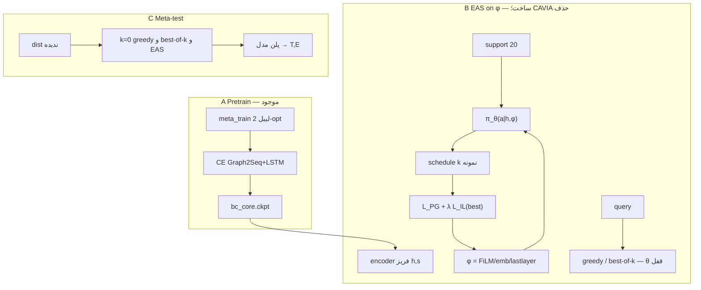

# معماری نهایی MARGO (`MARGO-METHOD-v0.3`)

وضعیت: مشخصات روش. بخش‌های «موجود» در کد `mrlco-new` پیاده‌اند. بخش‌های «ساخت» هنوز نیستند.  
فیزیک، اسپلیت، obs، Graph2Seq، LSTM، `schedule()` = `MARGO-SPEC-v0.1`.  
موتور تطبیق v0.2 (**CAVIA-on-z** با `mean T`) و inner PPO روی θ **از روش حذف** شدند (ADR-007؛ فقط ablation منفی). موتور نامزد v0.3 = EAS روی زیرمجموعهٔ کوچک φ (فاز ۳). اگر گیت فاز ۳ رد شد: fallback = BC صفرشات + best-of-k (فاز ۱–۲).

`paper_result=false`. تگ‌های فریز `phase0`…`phase3` و `outer_iterations=3500` بازنویسی نمی‌شوند. آن حلقه ablation منفی می‌ماند.

---

## 0. یک جمله

سیاست یک پلن گسستهٔ ۲۰تایی `{UE,MEC,HELPER}` برای DAG می‌سازد. شبیه‌ساز یک‌بار زمان‌بندی می‌کند و `(T,E)` می‌دهد. استنتاج = greedy یا best-of-k از π (ADR-008). تطبیق نامزد = EAS روی φ با encoder/LSTM قفل (ADR-007). **CAVIA-on-z از روش حذف شد.**

```text
G  →  obs[20,50]  →  Graph2Seq h[20,256] + triple readout s[128]
                  →  FiLM(s, z)  →  LSTM+Luong  →  a[20]∈{0,1,2}
                  →  schedule(zip(order,a))  →  T[s], E[J]
```

---

## 1. مسئله و کنش (موجود)

موجودیت‌ها: یک UE، یک MEC، یک HELPER، شش منبع ظرفیت-۱ غیرپیش‌دستانه.

| `a` | نام | `Location` |
|---:|---|---|
| 0 | UE / Local | `Location.UE` |
| 1 | MEC | `Location.MEC` |
| 2 | HELPER / V2V | `Location.HELPER` |

نگاشت: `Location.from_action` در `env/mec_offloaing_envs/scheduler/model.py`.

پلن = جایگشت `prioritize_sequence` زیپ‌شده با ۲۰ کنش. فضا ریاضی `3^20`. سیاست این فضا را brute نمی‌کند.

هدف آموزش/گزارش primary:

```text
J = 0.5 * (L / L_scale) + 0.5 * (E / E_scale)
E = total_mobile_joules = UE + HELPER  (محاسبهٔ MEC در v0.1 داخل هدف نیست)
```

نرمال: محدودهٔ سه پلن خالص (همه-UE، همه-MEC، همه-HELPER) روی همان گراف. `OBJECTIVE_AND_ENERGY.md`.

نرخ فریز (`frozen_experiment.yaml`):

| منبع | مقدار |
|---|---|
| UE CPU / HELPER CPU | `1048576` B/s |
| MEC CPU | `10485760` B/s |
| MEC UL / DL | 7 Mi-Mbps → `917504` B/s |
| V2V | 5 Mi-Mbps → `655360` B/s |

V2V نیم‌دوطرفه. Makespan وقتی تمام است که خروجی **همهٔ sinkها به UE برگشته باشد**.

دو شاخص را قاطی نکن:

```text
task_id tid     ∈ {0..19}     گره DAG
decoder index k ∈ {0..19}     موقعیت HEFT = سطر obs = اندیس a[k]
```

`a[k]` مال تسک `prioritize_sequence[k]` است.

---

## 2. داده و اسپلیت (موجود)

مسیر: `env/mec_offloaing_envs/data/meta_offloading_20/offload_random20_{id}/random.20.{i}.gv`

```text
25 dist × 100 graph × 20 task = 2500 graph
latin_grid_holdout_v1    (محور: fat × density، نه CCR)
CCR ∈ {0.3, 0.4, 0.5} داخل هر نقش مخلوط است
```

| نقش | ID | در حلقهٔ متا؟ |
|---|---|---|
| meta_train | `{1,3,4,5,8,9,11,13,15,18,19,21,22,24,25}` | سمپل outer |
| validation | `{2,6,10,16,17}` | هر ۵۰ itr چک‌پوینت؛ نه تیون |
| meta-test | `{7,12,14,20,23}` | فقط eval نهایی |

داخل هر dist نگه‌داشته: support ۲۰ گراف + query ۸۰ گراف، بدون اشتراک (`stratified_sha256_rank_v1`).  
`spec/split_policy.json`, `spec/split_loader.py`.

پارس: `OffloadingDotParser` → `OffloadingTaskGraph` → `to_canonical_dag`:

- نود فایل 1-based → `task_id = job_id - 1`
- `size` → `compute_workload_bytes`
- `expect_size` → `task_output_bytes`
- یال `size` → `edge_output_bytes` از `edge_set`
- root: `external_input_bytes = processing_data_size`؛ غیر-root = ۰

ترتیب decoder: HEFT `prioritize_tasks` → `prioritize_sequence`.

---

## 3. Observation (موجود)

فایل: `env/mec_offloaing_envs/scheduler/encoder_obs.py`

```text
MAX_TASKS=20  MAX_NEIGH=19  FEATURE_DIM=11  PACKED_DIM=50
obs ∈ R^{20×50}     بچ: [B, 20, 50]    time_major=False
```

سطر decoder-index `k`:

```text
[ 11 ویژگی | 19 successor decoder-idx | 19 predecessor decoder-idx | mask ]
```

همسایه = اندیس decoder نه `task_id`. بدون self-loop. درجه>۱۹ خطا. PAD_INDEX=`-1`.

`FEATURE_NAMES`:

1. `compute_workload_bytes`
2. `task_output_bytes`
3. `external_input_bytes`
4. `incoming_edge_bytes`
5. `outgoing_edge_bytes`
6. `indegree`
7. `outdegree`
8. `decoder_index`
9. `depth`
10. `is_root`
11. `is_sink`

Z-score همه جز `is_root`/`is_sink` با `spec/encoder_feature_stats.json` (**فقط** آمار meta_train).  
اسناد قدیمی `obs_dim=20` باطل است.

---

## 4. Graph2Seq + triple readout (موجود)

فایل: `policies/graph2seq_encoder.py` — `Graph2SeqEncoderAdapter.encode`

`hidden_dim = encoder_units = 128`. خروجی نود **256**.

### 4.1 embed

```text
features [B,20,11]
  Dense(node_feature_embed) → [B,20,128]
  flatten → [B·20, 128]
  + ردیف dummy صفر برای PAD  → lookup جدول [B·20+1, 128]
```

### 4.2 دو جهت، دو لایه MeanAggregator، concat self∥neigh

`fw` = successor، `bw` = predecessor. `UniformNeighborSampler` روی جدول packed. Dropout=0.

هر جهت:

```text
لایه 0: input 128, W_self, W_neigh → 128, concat → 256
لایه 1: input 256, output concat → 256
reshape [B, 20, 256]
```

ترکیب جهت: **جمع + ReLU** (نه concat):

```text
h = ReLU(fw_hidden + bw_hidden) ∈ R^{B × 20 × 256}     # encoder_outputs
```

این حافظهٔ Luong است.

### 4.3 triple readout → init LSTM

روی نودها با `node_mask`:

```text
attn_logits = Dense(h) → [B,20,1]
α = softmax(logits + mask·(-1e9), axis=1)
attn_pool = Σ_k α_k ⊙ h_k          ∈ R^{B,256}    # اهمیت تسک
mean_pool = (Σ_k mask_k h_k) / Σ mask ∈ R^{B,256}  # بار متوسط
max_pool  = max_k (h_k + mask·(-1e9)) ∈ R^{B,256}  # گلوگاه / مسیر بحرانی

u = concat(mean, max, attn)        ∈ R^{B,768}
g = tanh(Dense(u))                 ∈ R^{B,256}    # readout_proj
s = Dense(g)                       ∈ R^{B,128}    # state_projection / state_dense
```

LSTM دو لایه: هر لایه `LSTMStateTuple(c=s, h=s)`.  
Luong جداگانه روی `h` نودی نگاه می‌کند؛ readout فقط **حالت شروع** است.

توجیه سهم: DAMRL decoder گراف-سطح ندارد؛ max-pool بایاس makespan (`T = max` مسیر) است. ablation اجباری: mean-only / max-only / triple / init صفر.

---

## 5. LSTM + Luong → پلن (موجود؛ شرط `z` ساخت)

فایل: `policies/meta_seq2seq_policy.py`

| مورد | مقدار |
|---|---|
| سلول | LSTM، `num_layers=2`، `decoder_units=128` |
| Attention | `LuongAttention(128, encoder_outputs)` + `AttentionWrapper(..., attention_layer_size=128)` |
| خروجی | Dense → `vocab_size=3` |
| embedding توکن | `[3, 128]` |
| `start_token` | **0** |
| `end_token` | **3** (بیرون `{0,1,2}`؛ ۲=V2V است) |

سه حالت:

| `model` | Helper | خروجی |
|---|---|---|
| `train` | `TrainingHelper` | teacher forcing؛ CE |
| `sample` | `FixedSequenceLearningSampleEmbedingHelper` | Categorical؛ طول ثابت ۲۰ |
| `greedy` | `GreedyEmbeddingHelper` | argmax؛ پد اگر کوتاه با `GREEDY_PAD_ACTION=1` |

گام decode `k=0..19` (بدون دیدن تقویم):

```text
ورودی توکن: k=0 → start=0 ؛ وگرنه a_{k-1}
state_k = LSTM(embed(a_{k-1}), state_{k-1})
context_k = Luong(state_k, h[0..19])
logits_k ∈ R^3
a_k ~ Cat(softmax(logits_k))     # sample
  یا argmax                          # greedy eval
```

خروجی سیاست: `actions ∈ {0,1,2}^{B×20}`. این **خروجی روش** است.

Q-head و `vf = Σ π·q` برای PPO لایهٔ قدیم وجود دارد (baseline/ablation، ADR-007). مسیر **CAVIA-on-z حذف شد**. critic در روش v0.3 استفاده نمی‌شود.

---

## 6. Context `z` و FiLM (ساخت — retained as the candidate parameter subset for Phase 3)

**v0.3:** FiLM روی حالت شروع LSTM نامزد `adapt_subset=film` در EAS است (فاز ۳). **CAVIA-on-z با `L_z = mean T` از روش حذف شد** (ADR-007). این بخش قرارداد φ را نگه می‌دارد، نه موتور CAVIA را.

این قطعه در ریپو **نیست** (`pearl`/`z_task` صفر). قرارداد:

```text
z ∈ R^{d_z}     d_z=32 پیش‌فرض روش (تیون ادعا نمی‌شود)
هر meta-task یک z دارد، نه هر گراف.
z=0 باید رفتار BC را عیناً بازتولید کند (رگرسیون فاز 0).
```

**FiLM روی حالت شروع LSTM** (نه تغییر بعد Luong در فاز اول):

```text
γ, β = Dense_γ(z), Dense_β(z)           # هر کدام → R^{128}
s̃ = γ ⊙ s + β
init LSTM ← LSTMStateTuple(c=s̃, h=s̃) برای هر دو لایه
```

مقداردهی: `γ←1`, `β←0` تا `z=0` ≡ BC.

جایگزین ممنوع در v0.2: concat `s∥z` که شکل ckpt را می‌شکند مگر projection جدا با init همانی.

`π(a | h, z)` = همان LSTM با init فیلم‌شده. Encoder در اولین تشخیص **فریز**.

---

## 7. فیزیک `schedule()` (موجود — محیط، نه جستجو)

فایل‌ها: `scheduler/engine.py` `schedule()`، `adapter.py` `schedule_via_adapter()`.

ورودی:

```text
graph: CanonicalDAG
decoder_order: prioritize_sequence          # طول 20
actions: [a_0 .. a_19] ∈ {0,1,2}           # هم‌تراز decoder_order
resources: ResourceConfig
```

الگوریتم:

1. `locs[tid] = from_action(a[rank[tid]])`
2. ترتیب اجرا = توپولوژیک پایدار؛ گره آماده با کمترین `decoder_rank` اول
3. برای هر تسک: داده از والدین (یا external root از UE) طبق `routes.ROUTE_TABLE` به محل اجرا برسد؛ CPU محل در تقویم رزرو شود؛ residency خروجی = محل اجرا
4. sinkها در پایان به UE برگردند

جدول مسیر:

| از \ به | UE | MEC | HELPER |
|---|---|---|---|
| UE | ∅ | MEC_UL | V2V |
| MEC | MEC_DL | ∅ | MEC_DL+V2V |
| HELPER | V2V | V2V+MEC_UL | ∅ |

خروجی `ScheduleResult`: `makespan_seconds`, `energy.total_mobile_joules`, رکورد تسک/انتقال.

شبکه T را پیش‌بینی نمی‌کند. گرادیان از تقویم عبور **نمی‌کند**.

---

## 8. پاداش تلسکوپی (موجود؛ برای تطبیق فاز ۳ روی φ، نه CAVIA)

فایل: `scheduler/reward.py` `telescoping_token_rewards`

قرارداد: decoder تقویم را آنلاین نمی‌بیند. بعد از پلن کامل، N برنامهٔ موقت:

```text
P_t = پیشوند a_1..a_t + پسوند fill=0 (all_UE)
P_0 = همه-UE (از refs؛ زمان‌بندی اضافه تکرار نمی‌شود)
r_t = -(0.5 ΔL_t / L_scale + 0.5 ΔE_t / E_scale)
sum_t r_t ≡ امتیاز کل پلن نسبت به P_0
```

برای تطبیق روی support (فاز ۳ EAS، نه CAVIA)، دو انتخاب مجاز (باید در لاگ قفل شود):

- `L_z = -mean_g sum_t r_t` روی ۲۰ گراف support (انتشار تلسکوپی)
- `L_z = mean_g J_g` با `J = 0.5 L_norm + 0.5 E_norm` روی پلن کامل (ساده‌تر)

**CAVIA `L_z = mean T` خالص حذف شد** (سه ران، query تخت؛ ADR-007). پیشنهاد فاز ۳: POMO baseline + imitation به best-so-far.

`env.step` لایهٔ A همان تلسکوپ را برمی‌گرداند و `done=True` بعد از یک پلن.

---

## 9. Meta: stub (CAVIA-on-z removed)

**CAVIA-on-z از روش حذف شد.** جزئیات و اعداد: `spec/decisions/ADR-007-adaptation-engine.md`.  
موتور نامزد: EAS روی φ، پرامپت `spec/prompts/PHASE3_EAS_SUPPORT_ADAPTATION.md`.  
Fallback: BC صفرشات + best-of-k (ADR-008). محور سناریو جدا: ADR-009 / فاز ۴.

Inner PPO روی θ و `MRLCO.UpdateMetaPolicy` فقط ablation منفی‌اند. PEARL `q(z|s,a,r,s')` ساخته نمی‌شود.

گیت فاز ۳ (validation): query greedy T از 575–582 به **≤520**؛ occupancy Local 0.15–0.25. رد → بدون ادعای meta-adaptation.

---

## 10. Pretrain BC (موجود — مرحله A، روش کامل نیست)

معلم‌ها (جستجو **فقط برای لیبل train**):

| نام | تابع | نقش در روش نهایی |
|---|---|---|
| greedy-from-MEC | `greedy_from_mec_plan` | لیبل BC اولیه |
| 2-opt | `iterate_2opt` | لیبل BC فعلی `bc_2opt` |
| publication greedy | `greedy_plan` | baseline گزارش؛ معلم BC نیست |

آموزش A: Adam `5e-4`، CE teacher-force، بچ ۳۲، `bc_core.ckpt`.  
Eval A: greedy decode + **یک** `schedule_via_adapter`؛ بدون pair refine.

ckpt مرجع تشخیص: `runs/phase4/margo_v0.1_diag_bc_2opt/seed_0/`.

---

## 11. آنچه روش نیست

- pair scan / bestimp / 2-opt در **استنتاج مقاله**
- inner PPO روی θ (`k_steps=3` فریز) به‌عنوان موتور
- PEARL dual-buffer/VAE به‌عنوان ادعا (مگر ablation)
- GAT / DiffPool / مشاهدهٔ گام‌به‌گام منبع
- پیش‌بینی مستقیم makespan توسط شبکه
- `end_token=2`
- شروع 3500 (گیت CAVIA مرده است؛ ADR-007)

Pair diagnostics سقف فیزیکی می‌مانند (جستجو چقدر جا دارد). در مقاله: oracle/heuristic baseline نه جزء `π`.

---

## 12. تصویر کلان روش


